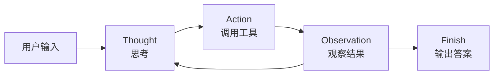
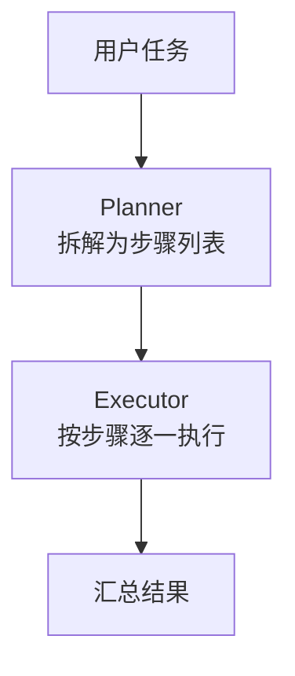
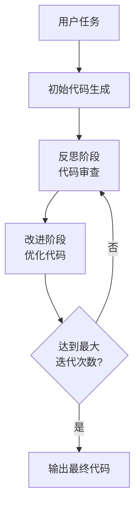
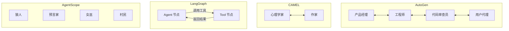
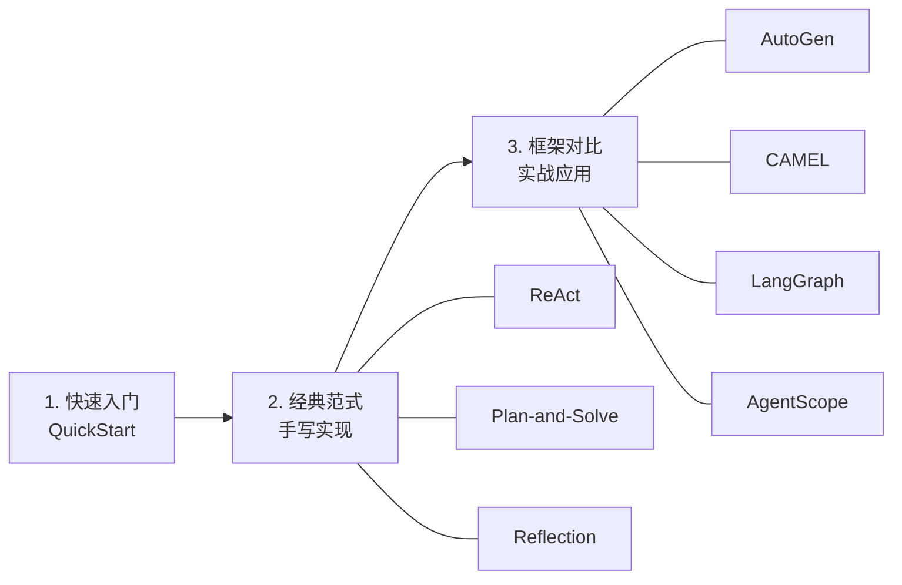

# AI Agent 学习与实践

> 从零开始学习 AI Agent —— 涵盖经典范式手写实现 + 主流框架对比实战

## 项目简介

本项目是一个 AI Agent 的学习与实践仓库，包含以下核心内容：

- **快速入门**：用最简代码跑通一个 ReAct Agent
- **经典范式手写实现**：不依赖框架，手写 ReAct / Plan-and-Solve / Reflection 三大经典 Agent 范式
- **主流框架对比实战**：用 AutoGen、CAMEL、LangGraph、AgentScope 四大框架构建实际应用

## 项目结构

```
ai-agent/
├── QuickStart/                              # 快速入门
│   └── QuickStart.py                        #   ReAct 旅行助手 Demo
│
├── ConstructionOfClassicAgentParadigms/      # 经典 Agent 范式手写实现
│   ├── LLMClient.py                         #   LLM 客户端基础封装
│   ├── PlanAndSolveAgent.py                 #   Plan-and-Solve 范式
│   ├── ReAct/                               #   ReAct 范式
│   │   ├── ReActAgent.py                    #     ReAct Agent 骨架
│   │   ├── SearchTool.py                    #     搜索工具（SerpApi）
│   │   └── ToolExecutor.py                  #     工具注册与执行器
│   └── Reflection/                          #   Reflection 反思范式
│       ├── Memory.py                        #     轨迹记忆模块
│       └── Reflection.py                    #     反思 Agent（代码迭代优化）
│
├── framework-study/                         # 主流框架对比实战
│   ├── AutoGen/                             #   AutoGen —— 多 Agent 软件开发团队
│   ├── CAMEL/                               #   CAMEL  —— 角色扮演协作
│   ├── LangGraph/                           #   LangGraph —— 状态图 ReAct Agent
│   └── AgentScopeDemo/                      #   AgentScope —— 三国狼人杀游戏
│
├── doc/                                     # 学习文档
│   └── 二、agent 快速入门.md
│
├── run_reflection.py                        # Reflection Agent 运行入口
└── README.md
```

## 模块详解

### 一、快速入门（QuickStart）

一个最简 ReAct 旅行助手，输入城市名称，自动查天气 → 推荐景点。

- 封装了 OpenAI 兼容客户端
- 集成天气查询（wttr.in）和景点搜索（Tavily）
- 用正则解析 Thought → Action → Observation 循环



### 二、经典 Agent 范式手写实现（ConstructionOfClassicAgentParadigms）

不借助任何框架，纯手写三大经典范式：

| 范式 | 核心思想 | 对应文件 |
|------|---------|---------|
| **ReAct** | 思考 → 行动 → 观察，循环推理 | `ReAct/` |
| **Plan-and-Solve** | 先制定计划，再逐步执行 | `PlanAndSolveAgent.py` |
| **Reflection** | 生成 → 反思 → 改进，迭代优化 | `Reflection/` |

#### Plan-and-Solve 流程



#### Reflection 流程



### 三、主流框架对比实战（framework-study）

| 框架 | 场景 | 亮点 |
|------|------|------|
| **AutoGen** | 多 Agent 软件开发团队 | 产品经理 + 工程师 + 代码审查员协作，Round-Robin 群聊 |
| **CAMEL** | 心理学电子书写作 | 心理学家 + 作家角色扮演，任务自动细化 |
| **LangGraph** | 天气 & 搜索助手 | 状态图工作流，条件分支路由，流式输出 |
| **AgentScope** | 三国狼人杀游戏 | 多角色博弈，昼夜轮替，投票与讨论机制 |



## 快速开始

### 环境要求

- Python 3.10+
- OpenAI 兼容 API（如 DeepSeek、OpenAI 等）

### 安装依赖

各模块有独立的依赖，按需安装：

```bash
# AutoGen
pip install -r framework-study/AutoGen/requirements.txt

# CAMEL
pip install -r framework-study/CAMEL/requirements.txt

# LangGraph
pip install -r framework-study/LangGraph/requirements.txt

# AgentScope
pip install -r framework-study/AgentScopeDemo/requirements.txt
```

### 配置 API Key

```bash
# 设置环境变量（以 DeepSeek 为例）
export OPENAI_API_KEY="your-api-key"
export OPENAI_API_BASE_URL="https://api.deepseek.com"
```

或参考 `framework-study/AutoGen/.env.example` 创建 `.env` 文件。

### 运行示例

```bash
# 快速入门 - ReAct 旅行助手
python QuickStart/QuickStart.py

# Reflection Agent - 代码迭代优化
python run_reflection.py

# AutoGen - 多 Agent 协作
python framework-study/AutoGen/main.py

# CAMEL - 角色扮演
python framework-study/CAMEL/camel_demo.py

# LangGraph - 状态图 Agent
python framework-study/LangGraph/langgraph_demo.py

# AgentScope - 三国狼人杀
python framework-study/AgentScopeDemo/main.py
```

## 学习路线



建议按 **快速入门 → 经典范式 → 框架实战** 的顺序学习，先理解底层原理，再用框架提效。

## @author

DD
